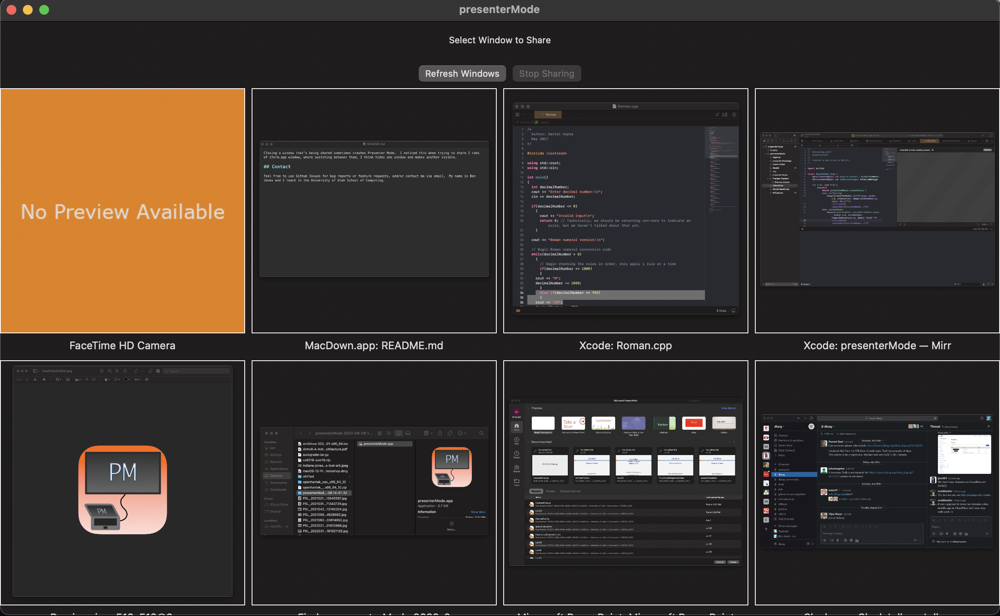

# Presenter Mode

Presenter mode is a Mac App for mirroring a window or ipad into another window.

Why would you do this?

This has been super useful to me as a professor when I want to live code or show something in a terminal in class, but want to keep some notes open for myself.  

Before Presenter Mode, I could either mirror my laptop display, which means my notes are visible to my students as well me, or I could extend my display to the projector, and try to contort my head to look at the projector while keeping my laptop screen private. 

With Presenter Mode, I extend my desktop to the projector and maxmize the Presenter Mode mirror window onto it.  Then I can share any window I want to the projector and quickly switch between slides, code, terminal, or my iPad screen.  I can also share my mirror window over Zoom so remote students see the same things that in-person students do, and only the window I want is recorded.

## User Manual

The UI is pretty basic.  When you open it, you'll get a preview of all your open windows:

If you click one of them, it'll open a new window that mirrors the live contents of the window you selected.  The mirror is updated at 30FPS, so it's pretty smooth, if a bit CPU hungry.  If you have an iPad plugged in, you can also mirror it.  (You can also mirror your webcam because it uses the same API as iPads...)

To share something else, just another preview and the mirror window will switch to it.  

Note, the preview do not update automatically, and the list of windows is not updated when you open a new window, so you may need to press the "Refresh Windows" button to get up today previews.

And that's it, that's the app.

When you run it the first time, you'll probably have to OK to run code that's downloaded from the internet, and Presenter Mode will request some permissions (for screen recording, and camera which is needed for ipad mirroring).  The app does not use the network or touch any files.  You may also need to set your ipad up to trust your laptop.

## Known Bugs

Occasionally when selecting my iPad to mirror, I just get a black screen.  Resetting the ipad (hold the top + volume buttons for a few seconds, and turn it off, wait a few seconds, and turn it back on) fixes this.  I usually restart Presenter Mode too, but I don't know for sure that it's necessary.

Closing a window that's being shared sometimes crashes Presenter Mode.  I noticed this when trying to share 2 tabs of iTerm.app window, where switching between them, I think hides one window and makes another visible.

## Contact

Feel free to use Github Issues for bug reports or feature requests, and/or contact me via email.  My name is Ben Jones and I teach in the University of Utah School of Computing.